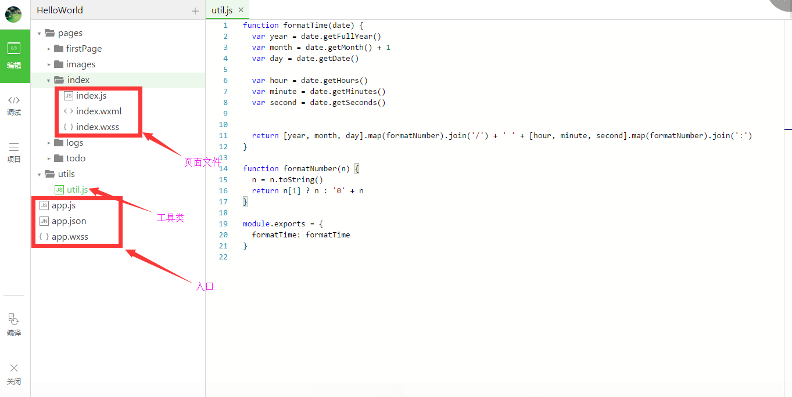

# WX
微信小程序

我的第一个微信小程序：
  小程序火爆了朋友圈，所以我也来新鲜一把， 看到小程序的文档后，发现和vue、react这种框架很像，都是根据面向对象的思想进行搭建的。但是小程序中不能使用jquery和zepto,
  因为在小程序中没有window，无法进行dom操作。
  
### 入口： app.js
   创建一个app对象，该对象有一个完整的生命周期
   
### 入口：app.json
   该文件中配置了所有要发布的页面模块，该模块可包含js、json、wxml、wxss文件，且这些文件的名称最好一致
   
### 页面文件js
   创建一个page对象，该对象拥有完整的生命周期，可以在不同的时期，进行不同的操作

### 结构
  

